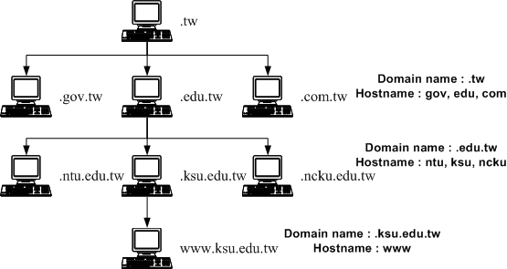

## 什麼是 DNS？Google 有提供的公開的 DNS，對 Google 的好處以及對一般大眾的好處是什麼？
Domain name system :<br>
這個系統的作用在於將全世界的主機名稱與 IP 對應。<br>本質上是一個超大型的資料庫，因此用單一主機完成這件事並不現實，而這套系統可以有效的降低主機的負載，並且分層化的管理。


>DNS 利用類似樹狀目錄的架構，將主機名稱的管理分配在不同層級的 DNS 伺服器當中，經由分層管理， 所以每一部 DNS 伺服器記憶的資訊就不會很多，而且若有 IP 異動時也相當容易修改！因為你如果已經申請到主機名稱解析的授權， 那麼在你自己的 DNS 伺服器中，就能夠修改全世界都可以查詢到的主機名稱了！而不用透過上層 ISP 的維護呢！ 自己動手當然是最快的啦！
>  			----鳥哥

而對使用者而言 DNS sever，就是根據傳出的網址，得到對應的 IP 。

---

Google : 可以得到不同地區使用者的動向，可以記錄不同 IP 的瀏覽習慣，針對性地v下廣告，或是做各式不同的分析。

使用者：有一個穩定的 DNS sever 。

<br>
根據上圖可以發現，其實提供服務的 DNS sever 可以得到 Client 的所有瀏覽資料，甚至可以屏蔽掉特定網域？因此如何選擇一個可以信任的 DNS sever 就將是一個很重要的選擇了。

[主機名稱控制者：DNS 伺服器_鳥哥](http://linux.vbird.org/linux_server/0350dns.php)


## 什麼是資料庫的 lock？為什麼我們需要 lock？

避免 race condition ，例如說購物網站在搶票的時候，因為同一時間會有很多人對同一個 item 發出 request 因此可能造成超賣的問題，為了避免這個問題，lock 的概念就是，當我要修改目標 item 時，會先把 item 鎖起來，等把資料修改完再將 lock 解開。
## NoSQL 跟 SQL 的差別在哪裡？
####NoSQL(not-only-SQL):
非關聯式資料庫，大多以 JSON 格式儲存資料，用 key-value 做管理，儲存結構不固定 ( 鍵值、文件和圖形等多種資料模型 ) ，相較 SQL 有更高的吞吐量工作負載。<br/>
e.g. : MongoDB

####SQL:
關聯式資料庫：強調資料的一致性，有標準化的規格，用於專門用於交易性以及高度一致性的線上交易處理。嚴格的遵守 ACID 的原則。

[什麼是 NoSQL？_AWS](https://aws.amazon.com/tw/nosql/)

## 資料庫的 ACID 是什麼？
>ACID 是為了保持 Transation 的正確性所訂定的原則：

####Ａ(atomicity)：<br/>
原子性，Transation 裡面的所有動作會被綑綁在一起，要嘛全部成功或是全部失敗，不能只成功其中一個動作

####Ｃ(consistency)：<br/>
一致性，維持資料的一致性。

####Ｉ(isolation)：<br/>
隔離性，多筆交易間不會互相影響。

####Ｄ(durability)：<br/>
持久性，交易成功後造成的改變永久成立，寫入的資料不會不見。

--

#####Transation:<br/>
交易，一組交易是由很多個針對不同資料庫的動作所組成。
自訂 Transation：

```
$conn->autocommit(FALSE);
$conn->begin_transcation();    //開始自訂Transation
$conn->query("update money set amount = 20");
$conn->query("update money set sum = 10");
$conn->commit();              //編輯完成
```