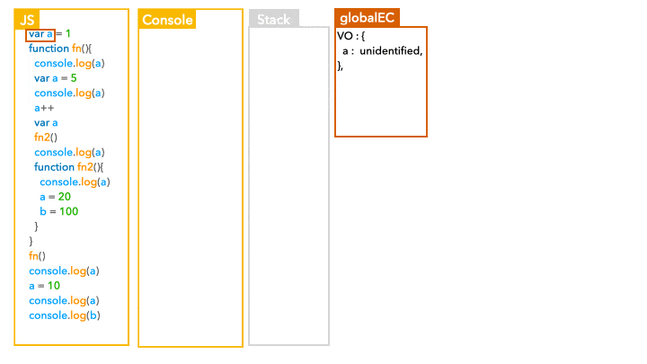

```
var a = 1
function fn(){
  console.log(a)
  var a = 5
  console.log(a)
  a++
  var a
  fn2()
  console.log(a)
  function fn2(){
    console.log(a)
    a = 20
    b = 100
  }
}
fn()
console.log(a)
a = 10
console.log(a)
console.log(b)
```
示意圖：


output:

```
Unidentified
5
6
20
1
10
100
```

