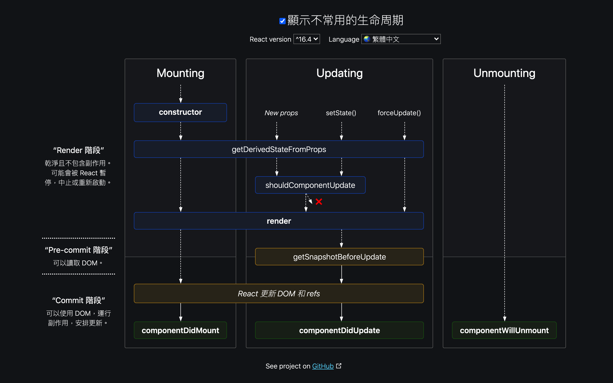

## 請列出 class component 的所有 lifecycle 的 method，並大概解釋觸發的時機點

[react lifecycle](https://projects.wojtekmaj.pl/react-lifecycle-methods-diagram/)


## setState()
class component：在 constructror 要記得帶入 props，call super()的時候也要帶入 props<br>
跟 componentDidUpdate() 有異曲同工之妙

```
class Title extends Component {
  constructor(props){
    super(props);
  }

  render(){
  }
}
```
---
setState()是非同步的，如果要取改變過後值，setState()的第二個參數是一個 callback function

##componentDidMount () 與 componentWillUnmount ()

當 Component 被呼叫之後執行 constuctor ，但這時候還沒掛到 DOM 上面，掛到 DOM 的動作稱為 Mount，componentDidMount ( ) 就是在 Mount 之後要執行的動作(通常作為資料初始化之用)，而 componentWillUnmount 則是在 Unmount 之前所要執行的動作，因為有些針對 DOM 的 function 在指定的 DOM 元件被解散後會無法執行

範例：

```
  class Title extend Component {
    constructor(props){
      super(props);
      this.state ={
        title : "hello"
      }
    }
    componentDidMount () {
	  this.timer = setTimeout ({
	    this.setSate({
	      title : "ya~~"
	    })
	  } , 2000);
    }
    componentWillUnmount () {
      clearTimer(this.timer);
    }
      
  }
```
  
##componentDidUpdate() 
當 component 改變後才 call 的 function <br>
跟 setState() 第二個參數的 callback function 有異曲同工之妙

```
  componentDidUpdate(prevProps,prevState) {
      return /
  }
```

--


#提升效能

##PureComponent

跟 functional component 內的 memo 是一樣的功能，在 compoent 內的值不變時， compoent 不會變動

```
class Compoent extend from React.PureComponent {

}
```
##shouldComponentUpdate() 

  ```
  shouldComponentUpdate(nextProps,nextState) {
      return //預設回傳 true
  }
  ```
  根據回傳值決定要不要 call render (true 或是 false)
  
  範例：
  
  ```
  class Title extend Component {
      shouldComponentUpdate(nextProps) {
        if (nextProps.title !== this.props.title) {
          return true
        }
      return false
      }
  }
  ```


